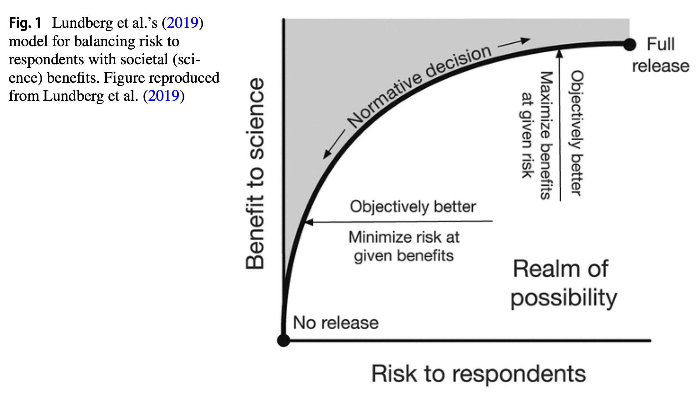
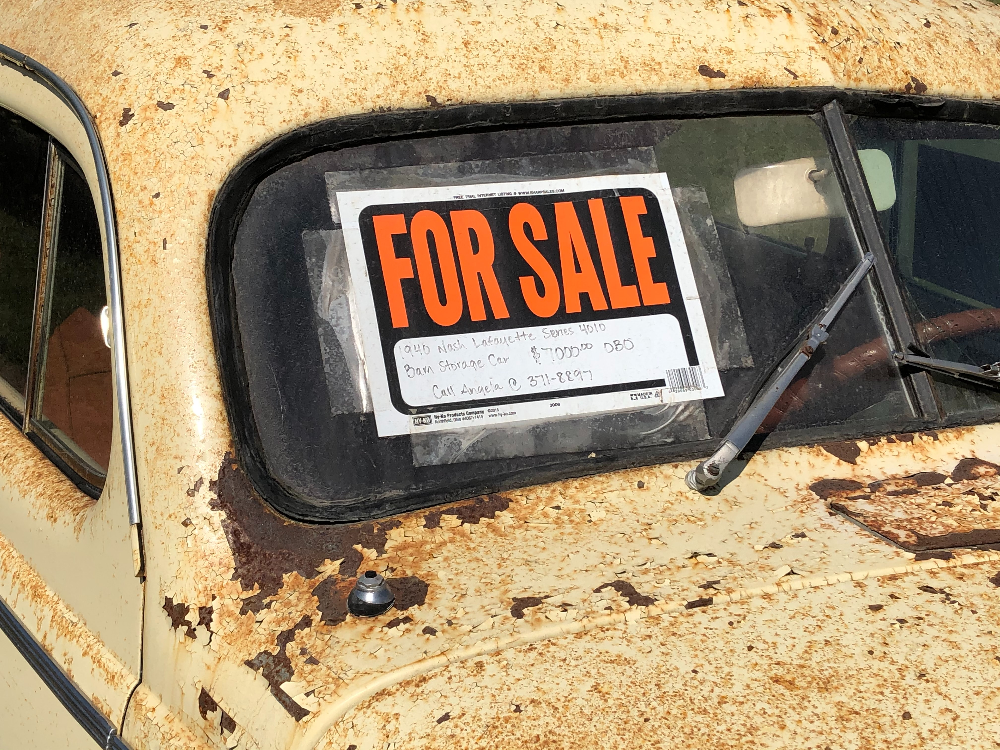
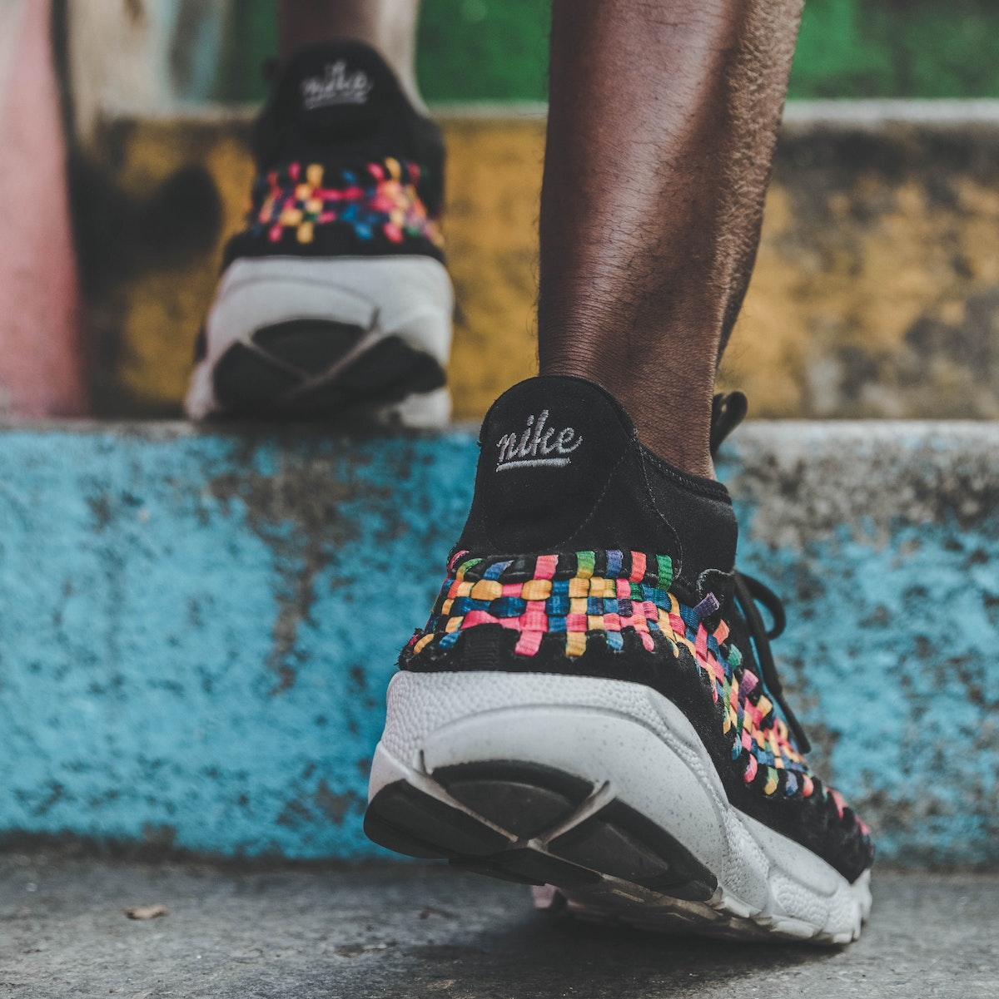
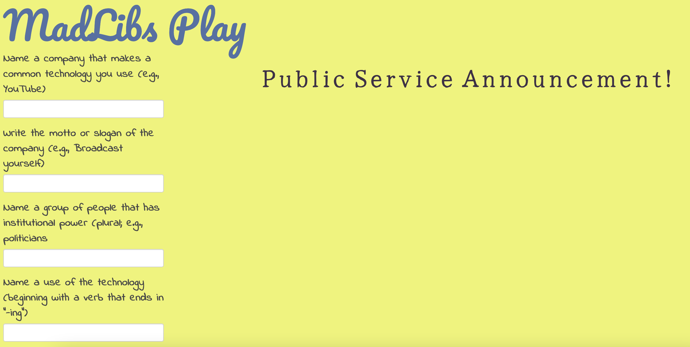
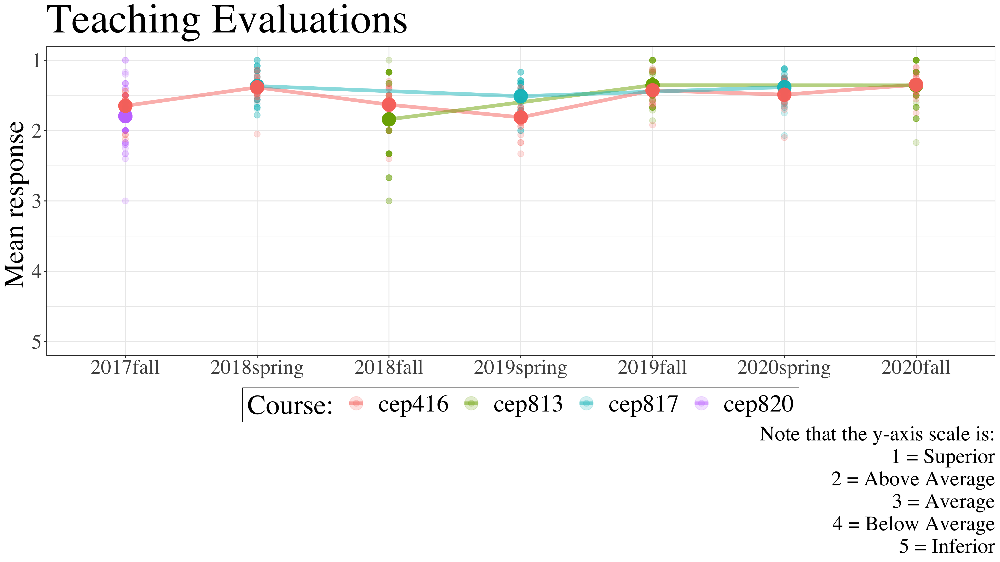

```{r setup, include=FALSE}
usethis::use_git_ignore(c("*.csv", "*.rds"))
options(htmltools.dir.version = FALSE)

library(knitr)
library(tidyverse)
library(xaringan)
library(fontawesome)
```

class: inverse, center, middle

# `r fa("far fa-images", fill = "#fff")`

**View the slides:** 

[bretsw.github.io/tc-lecture](https://bretsw.github.io/tc-lecture)

---

class: inverse, center, middle

# `r fa("far fa-file-alt", fill = "#fff")` <br> Seeking Balance

---

# Seeking Balance

```{r, out.width = "560px", echo = FALSE, fig.align = "center"}

```

- Article: "Balancing Privacy and Open Science in the Context
of COVID‐19" ([Rosenberg & Staudt Willet, 2021](https://doi.org/10.1007/s11423-020-09860-8))

--

- How much data to share?

--

- With whom?

---

# Seeking Balance

```{r, out.width = "720px", echo = FALSE, fig.align = "center"}

```

--

- Privacy `r fa("fas fa-balance-scale", fill = "#782F40")` Open science

--

- Minimize risks to participants `r fa("fas fa-balance-scale", fill = "#782F40")` Explore benefits to society

---

class: inverse, center, middle

# `r fa("fas fa-cog", fill = "#fff")` <br> Minimize Risks to Participants

---

# Minimize Risks

```{r, out.width = "600px", echo = FALSE, fig.align = "center"}
include_graphics("img/help.jpg")
```

--

- **Ethical** research: 

--

  - Protect participants

---

class: inverse, center, middle

#  `r fa("fas fa-exclamation-circle", fill = "#fff")` <br> **"Participant" "Rights"** <br> A few key questions

---

# Privacy

```{r, out.width = "600px", echo = FALSE, fig.align = "center"}
include_graphics("img/surveillance.jpg")
```

--

- What rights to live and behave from observation?

--

- Opt-in, or opt-out?

---

# Ownership

```{r, out.width = "560px", echo = FALSE, fig.align = "center"}

```

--

- Who **controls** my data?

--

- Who **profits** from it?

---

# Agency

```{r, out.width = "420px", echo = FALSE, fig.align = "center"}

```

--

- How much initiative by users is reasonable to expect?

--

- How does the need to be intentional and purposeful fall unevenly?

---

# Lessons from Dystopia

```{r, out.width = "720px", echo = FALSE, fig.align = "center"}

```

--

Imagine the worst possible way a tool could be used:

--

[**Get creative with a MadLib**](https://bretsw.shinyapps.io/madlibs-play/)


---

class: inverse, center, middle

# `r fa("fas fa-cog", fill = "#fff")` <br> Explore Benefits to Society

---

# Transparency

```{r, out.width = "600px", echo = FALSE, fig.align = "center"}

```

--

- Be open about when you are collecting or observing

--

- Share data ([Open Science Framework](https://osf.io/m25zy/))

--

- Share code for analysis ([GitHub](https://github.com/bretsw/))

---

# Example: Students' Data

```{r, out.width = "600px", echo = FALSE, fig.align = "center"}
include_graphics("img/open.jpg")
```

--

- Who benefits from students' data?

--

- Who has access to learning analytics data? 

--

- Who delivers feedback to students? Is this formative or summative?

---

# Example: Instructors' Data

--

```{r, out.width = "100%", echo = FALSE, fig.align = "center"}

```


---

class: inverse, center, middle

# `r fa("fas fa-balance-scale", fill = "#fff")` <br> Seeking Balance

---

# Example: Activity in a Park

```{r, out.width = "600px", echo = FALSE, fig.align = "center"}

```

--

- Should we ask people for consent to observe them?

--

- What are their expectations for being in public?

--

- What is ok to collect? What forms of analysis are ethical?

---

# Example: Activity in a Park

```{r, out.width = "600px", echo = FALSE, fig.align = "center"}

```

--

- Transparency is not enough: need regulation or moderation

--

- Peer/community review, government oversight, etc.

---

# Example: Traffic Data

```{r, out.width = "600px", echo = FALSE, fig.align = "center"}
include_graphics("img/traffic.jpg")
```

--

- Traffic data for [planning road projects](https://www.talgov.com/projects/projects.aspxs) vs. tracking one person

---

# Other Examples

```{r, out.width = "600px", echo = FALSE, fig.align = "center"}

```

--

- Are your research questions at a group level or individual?

--

  - Linking to library resources vs. tracking on person's reading history

--

  - [State of Florida payroll](https://www.floridahasarighttoknow.myflorida.com/search_state_payroll)

---

# Seeking Balance

```{r, out.width = "720px", echo = FALSE, fig.align = "center"}

```

--

- Twitter data vs. Reddit data

--

- Students' learning analytics data

--

- What else? (interactive space on a[ Miro board](https://miro.com/app/board/uXjVOclpr2U=/?invite_link_id=916201688499))

---

class: inverse, center, middle

# Questions?

```{r, out.width = "600px", echo = FALSE, fig.align = "center"}
include_graphics("img/question.jpg")
```

`r fa("envelope", fill = "white")` [bret.staudtwillet@fsu.edu](mailto:bret.staudtwillet@fsu.edu) | `r fa("twitter", fill = "white")` [@bretsw](https://twitter.com/bretsw) | `r fa("globe", fill = "white")` [bretsw.com](http://bretsw.com)